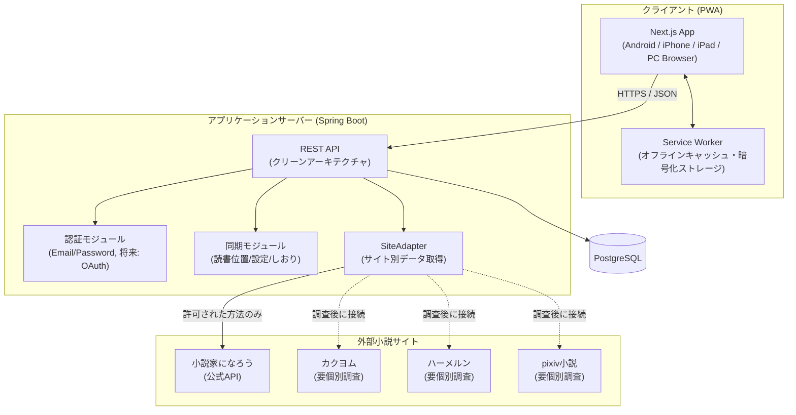
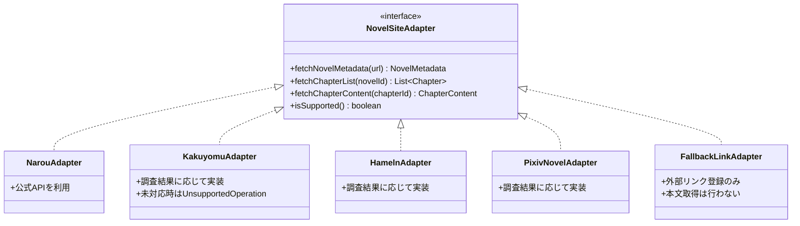
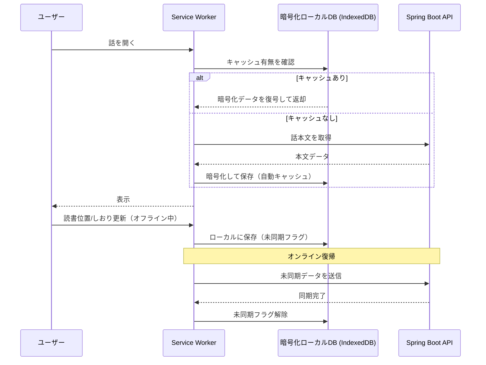
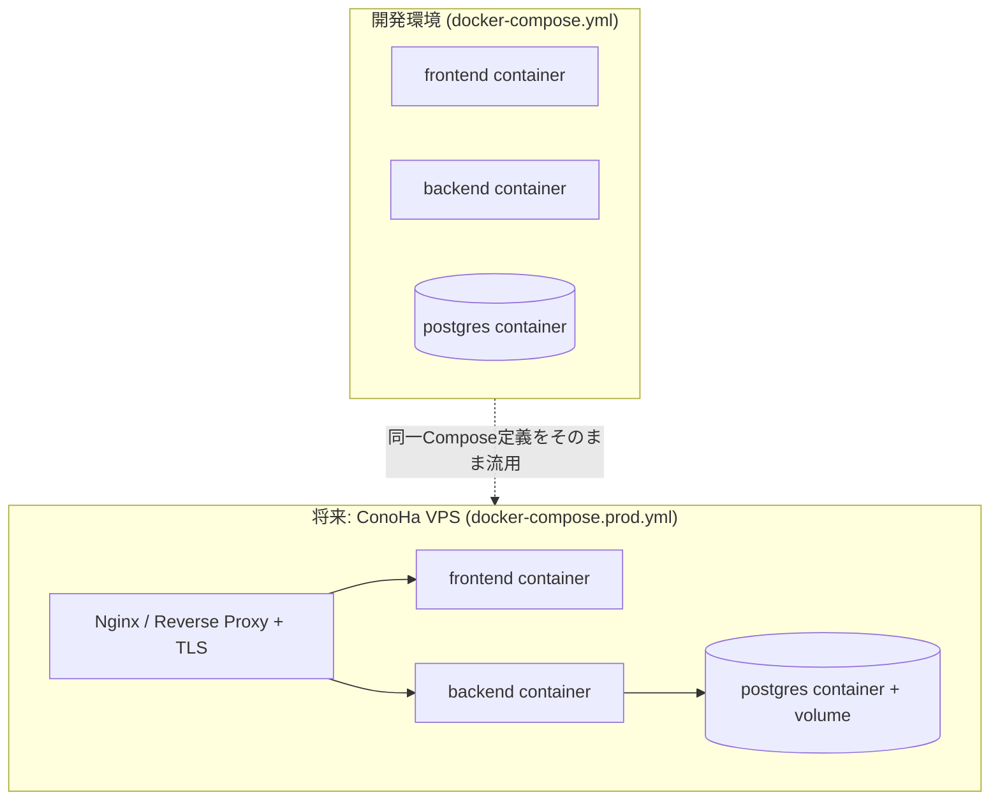
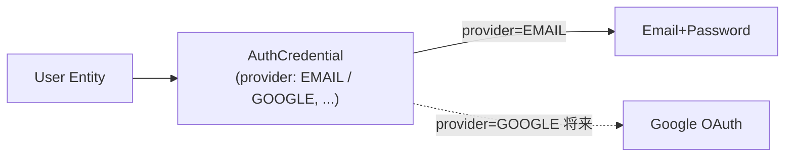

# NovelShelf システム構成

## 1. 全体構成図



## 2. SiteAdapter パターン（データ取得の抽象化）

サイトごとに取得可否・取得方式が異なるため、共通インターフェースの背後にサイト固有の実装を隠蔽する。



`isSupported()` が false を返すサイトは `FallbackLinkAdapter` に切り替わり、本棚には作品を登録できるが本文取得・オフラインキャッシュは行わず、閲覧はブラウザの別タブに委譲する。

## 3. オフラインキャッシュのデータフロー



## 4. レイヤー構成（バックエンド: クリーンアーキテクチャ）

```mermaid
flowchart LR
    subgraph Presentation
        Controller[REST Controller]
    end
    subgraph Application
        UseCase[UseCase / Service]
    end
    subgraph Domain
        Entity[Entity / Domain Model]
        Repo["Repository (interface)"]
    end
    subgraph Infrastructure
        RepoImpl["Repository実装 (JPA)"]
        AdapterImpl["SiteAdapter実装"]
    end

    Controller --> UseCase
    UseCase --> Entity
    UseCase --> Repo
    Repo <|.. RepoImpl
    UseCase --> AdapterImpl
    RepoImpl --> DB[(PostgreSQL)]
```

依存の向きは常に外側（Infrastructure）から内側（Domain）。Domain層は外部フレームワークに依存しない。

## 5. デプロイ構成（開発環境 → 将来の本番）



開発・本番で同じ Dockerfile / docker-compose 構成を使い、環境差分は `.env` と `docker-compose.prod.yml` の追加オーバーレイ（Nginx・TLS終端）のみで吸収する。VPSの詳細スペック・ドメイン取得はPhase6で確定（[USER_TODO.md](../USER_TODO.md)参照）。

## 6. 認証方式の拡張性



`User` と認証方式を1:Nで分離し、将来のGoogleログイン追加時にUserテーブルを変更せずに済む設計とする。
