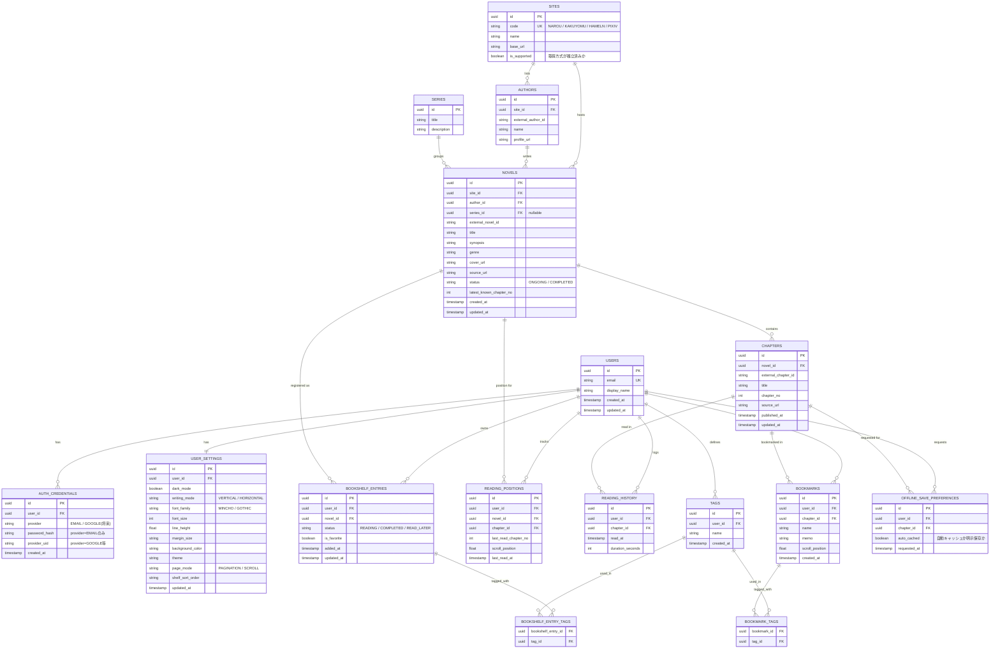

# NovelShelf ER図

## 設計上の補足

- 「お気に入り」は本棚ステータスと独立した真偽値 `is_favorite` として `bookshelf_entries` に持たせる（読書中のままお気に入り登録できるようにするため。要件の「読書中/お気に入り/読了/あとで読む」を単純な排他ステータスにすると `お気に入りかつ読書中` を表現できないための調整。詳細は[DECISIONS.md](../DECISIONS.md)）。
- 「更新あり」はユーザーが手動設定するステータスではなく、`novels.latest_known_chapter_no` と `reading_positions.last_read_chapter_no` の差分から導出する計算値（`has_update`）として扱う。
- タグは「本棚エントリ（作品の本棚登録）」と「しおり」それぞれに付与できるユーザー定義の自由タグ。ユーザーごとに独立する。
- オフラインキャッシュの実データ（本文）はサーバーに保持せず端末内に暗号化保存する。サーバー側は「どの話をオフライン保存したいか」という意図（`offline_save_preferences`）のみをクロスデバイス同期用に保持する。

## ER図

## 補足: 統計・カレンダーの算出方法

`読書統計` `読書カレンダー` は専用テーブルを持たず、`READING_HISTORY` を集計して算出する（読了作品数は `BOOKSHELF_ENTRIES.status = COMPLETED` の件数、読書時間は `READING_HISTORY.duration_seconds` の合計）。将来的に集計コストが問題になった場合はマテリアライズドビュー化を検討する（[KNOWN_ISSUES.md](../KNOWN_ISSUES.md)に記載）。
